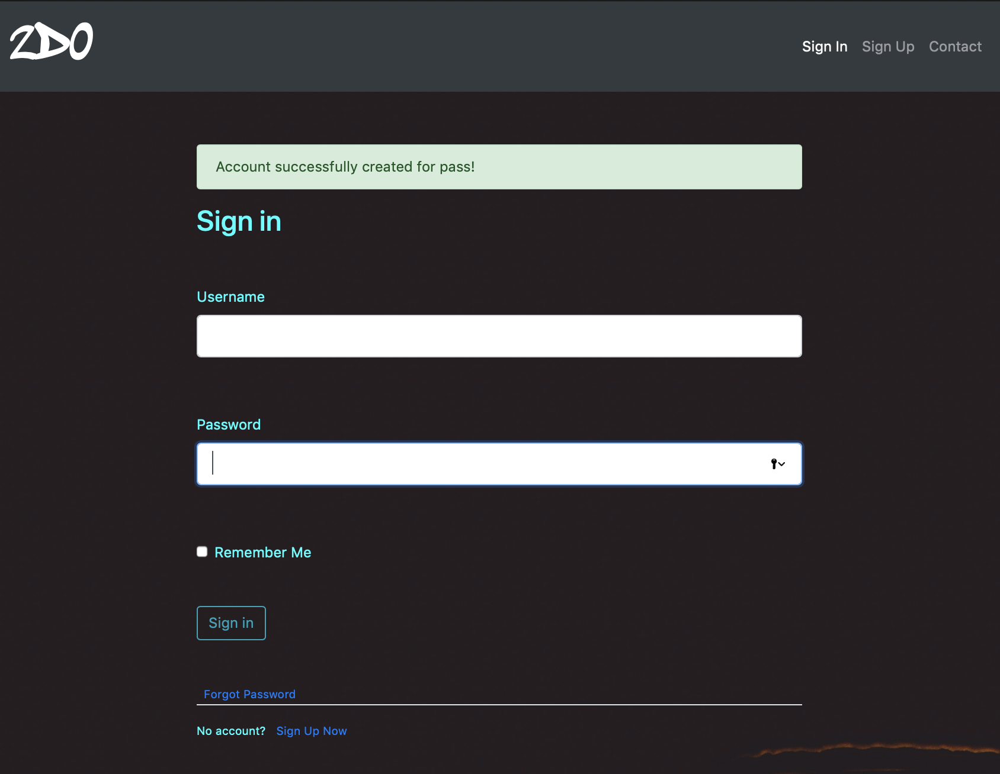
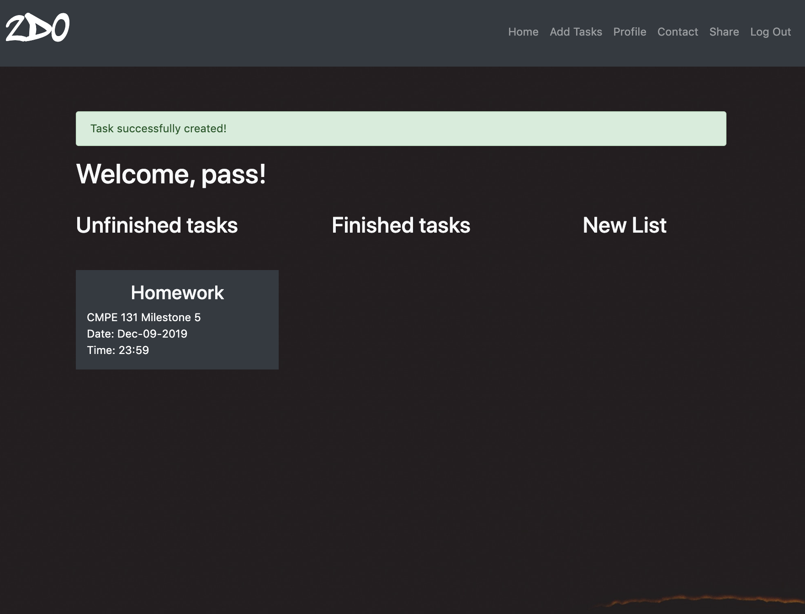
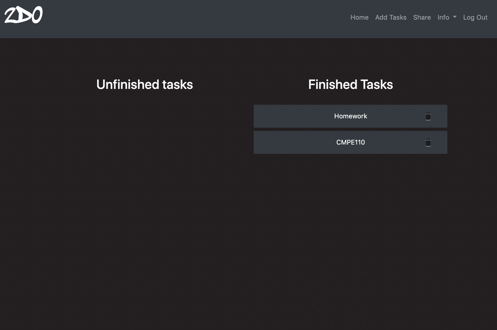
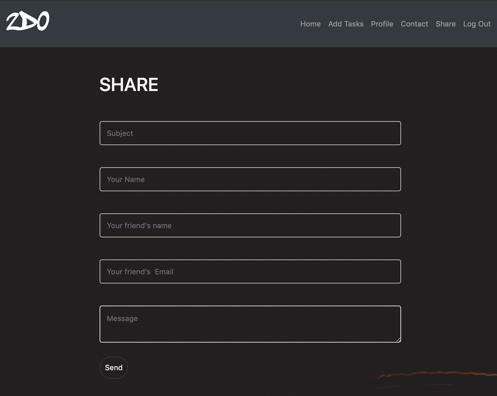
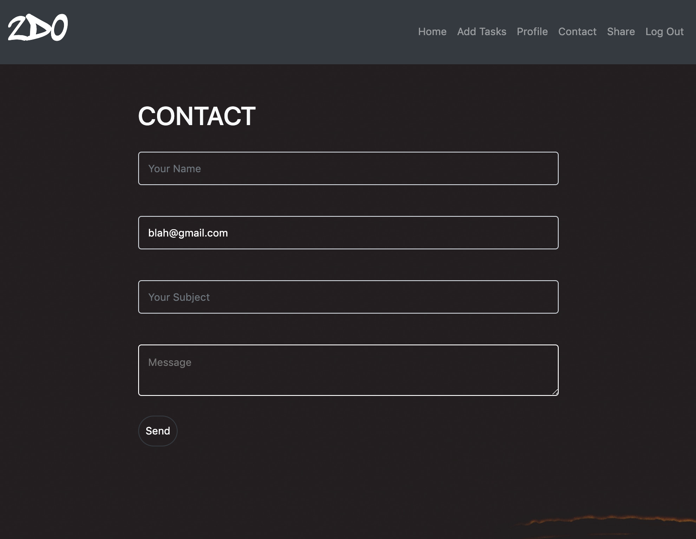

Features
========

*Registering*

New users can click SignUp from the navigation bar and will directed to this screen

.. image:: SignUp.png

*Sign In*

Users can login from the SignIn page as shown below.

*Add Tasks*

Users can add new tasks, by clicking on the add task from the navigation bar

.. image:: AddTask.png

*Home Page*

New Tasks are added to the Unfinished Task List

*Edit Tasks*

Clicking on the task header will allow you the user to finish, delete, or edit a task

.. image:: Edit1.png

Edit redirects you to this page

.. image:: Edit2.png

*Finished Tasks*

Once the user is done with a task, they can click on the check mark to move the task to the finished task list

*Profile*

Each user has a profile which they can access from the Info in the Navigation Bar.

.. image:: Profile.png

*Share*

Users can share their 2Do lists with friends by email. An email will then be sent containing a PDF of their unfinished tasks. Users must click on the Share header as shown below

*Contact*

Users can contact admin support and our admin email will receive an email with the users complaints

